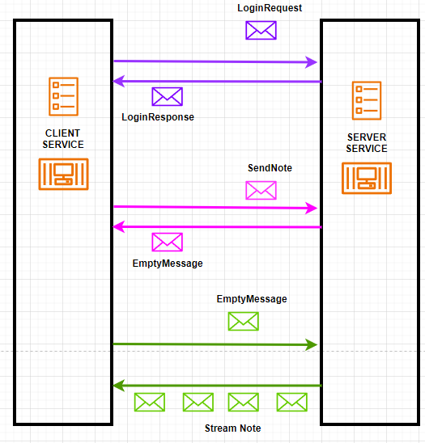
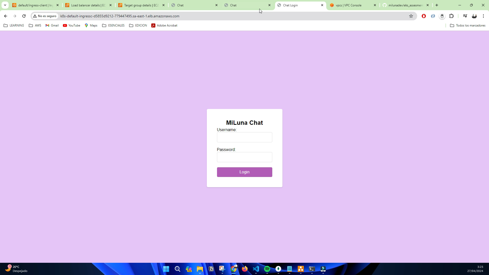
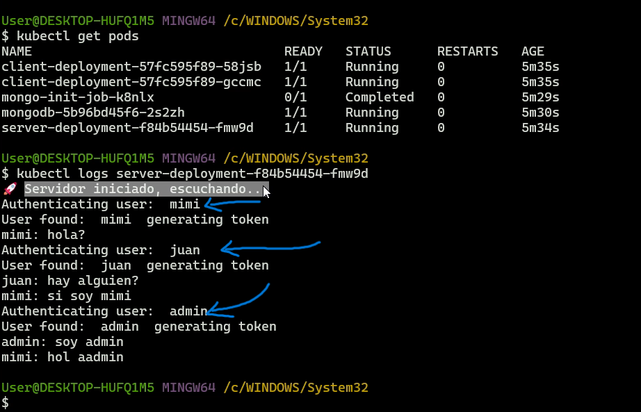
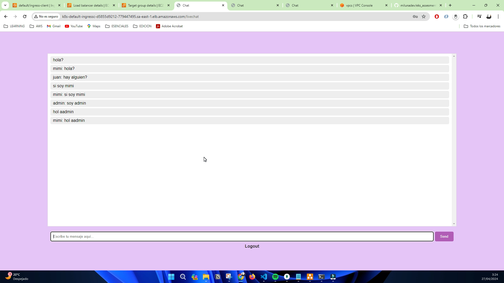
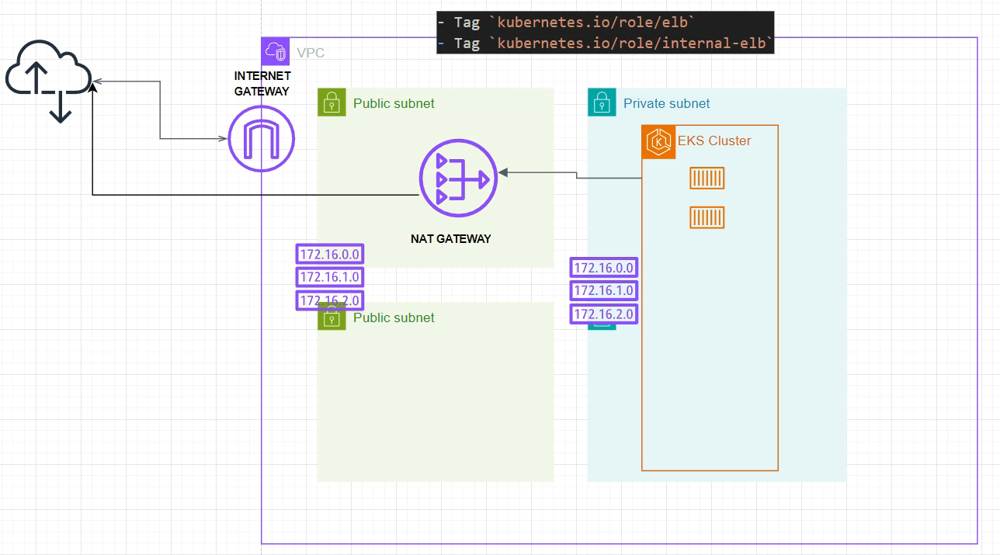
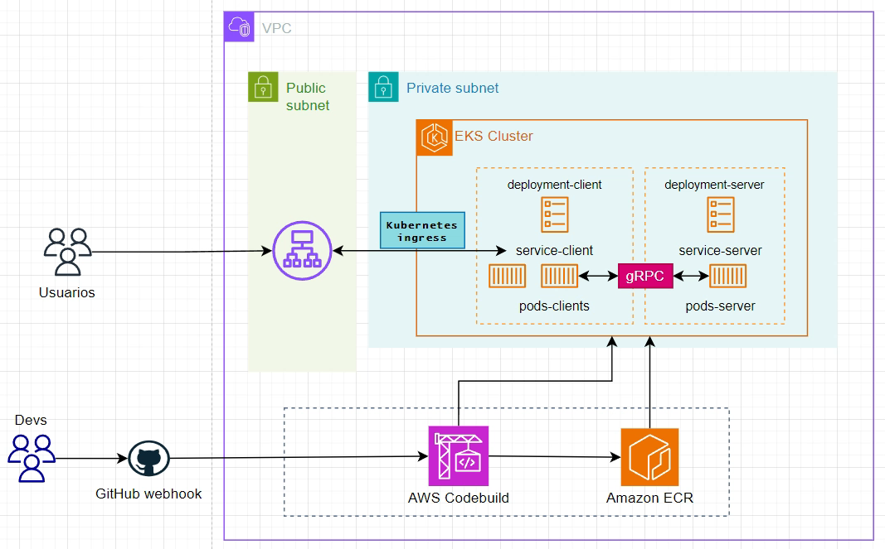
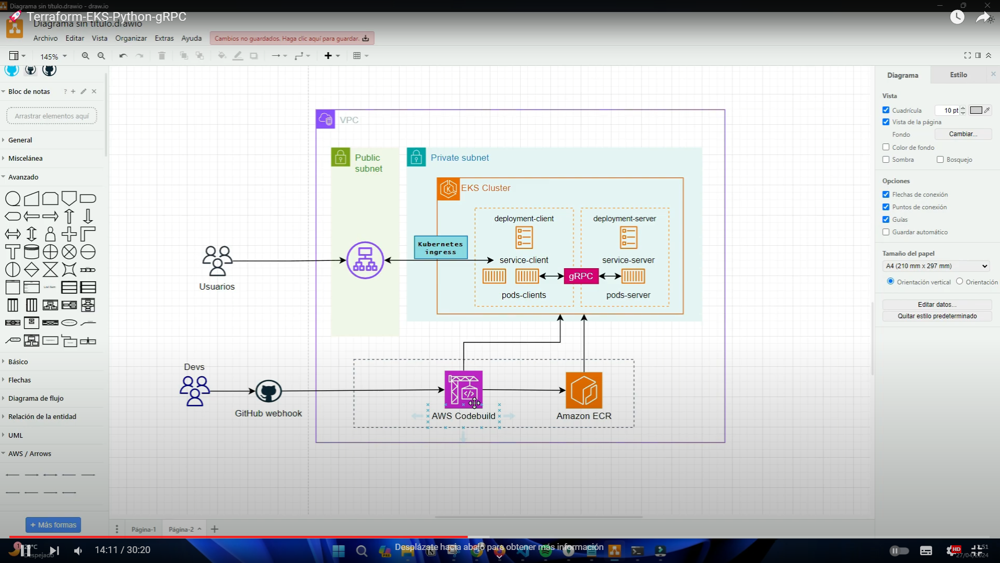

# PROYECTO TERRAFORM AWS EKS
## INTRODUCCION

Este proyecto se compone de un par de aplicaciones desarrollados en Python que conforman un sistema de chat interactivo que utiliza una arquitectura de microservicios. El proyecto se estructura en dos aplicaciones principales: un cliente y un servidor, que se comunican a través de gRPC un protocolo de alto rendimiento bastante usado para la comunicacion entre microservcios.



En nuestro caso, se utiliza para manejar las siguientes interacciones:

- **LoginRequest y LoginResponse:** Cuando un usuario intenta autenticarse, el cliente envía un LoginRequest al servidor. Si las credenciales son correctas, el servidor responde con un LoginResponse que contiene un token de sesión.
- **SendNote y EmptyMessage:** Para enviar mensajes, el cliente utiliza el método SendNote, que transmite los mensajes al servidor. El servidor responde con un EmptyMessage como acuse de recibo.
- **Stream Note:** El servidor utiliza un stream para enviar los mensajes a todos los clientes conectados. Esto permite una experiencia de chat en tiempo real, donde los mensajes se sincronizan instantáneamente entre todos los participantes de la sala.


### **Cliente:**

La aplicacion cliente se implementa mediant Flask, un framework de Python que facilita el desarrollo de aplicacion web, con ello levantamos una interface grafica amigable para los usuarios. Ademas tambien usamos Flask-SocketIO para gestionar salas de chat y actualizar dinámicamente la interfaz gráfica con los mensajes recibidos de otros usuarios en tiempo real.

🧐 Cada cliente se autentica inicialmente a traves de la clase AuthClient que se comunica con el servidor gRPC enviando las credenciales.

🙆‍♀️ Luego de la autenticacion cada cliente maneja a través de una instancia de la clase ChatClient, que se comunica con el servidor utilizando gRPC para enviar y recibir mensajes en tiempo real.

```python
class AuthClient:
    def __init__(self):
        self.channel = grpc.insecure_channel(server_url)
        self.stub = rpc.AuthServiceStub(self.channel)

    def authenticate(self, username, password):
        import messaging_pb2 as chat
        request = chat.LoginRequest(username=username, password=password)
.
.
.
class ChatClient:
    def __init__(self, username, token):
        self.username = username
        self.token = token
        # Creamos a channel gRPC + stub
        channel = grpc.insecure_channel(f'{server_url}')
        self.stub = rpc.ChatServerStub(channel)
        # Creamos un thread para recibir mensajes
        threading.Thread(target=self.receive_messages, daemon=True).start()

    def receive_messages(self):
        import messaging_pb2 as chat
        metadata = [('authorization', f'Bearer {self.token}')]
```
### **Servidor:**

El servidor tambien escrito en Python es responsable de manejar las solcitudes de autenticacion y de retransmitir los mensajes a todos los clientes conectados.

🧐 Por temas de tiempo la autenticacion se hace contra un diccionario hardcodeado definido en el codigo del servidor, idealmente esto debiera ser un una base de datos. Luego de la autenticacion se genera un token que sera usado por el cliente como metadata para validar su autenticacion.

🙆‍♀️ Una vez autenticados los usuarios pueden enviar mensajes y recibir los de otros usuarios, el servidor se encarga del streaming a todos los usuarios tambien.

### **Interaccion**

<p align="center">
<h4>Client se autentica, en servidor se valida y se genera un token</h4>
 
 
</p>

<p align="center">
<h4>Client envia y recibe mensajes, vemos diferentes sesiones/usuarios, srver imprime los mesnajes recibidos</h4>
 
 
</p>

## INFRAESTRUCTURA:
La infraestructura se desplego unicamente mediante terraform, a traves de 2 modulos principales, el modulo de red o networking y el modulo de eks.

```bash
module "networking_eks" {
  source = "./Networking"
  project_name = var.project_name
  private_subnet_number = var.network_module["private_subnet_number"]
  public_subnet_number = var.network_module["public_subnet_number"]
  availability_zones = var.network_module["availability_zones"]
}

module "eks" {
  source = "./eks"
  project_name = var.project_name
  eks_cluster_subnet_ids = module.networking_eks.private_subnet_ids
  eks_node_group_subnet_ids = module.networking_eks.private_subnet_ids
  eks_cluster_version = var.eks_cluster_version
  instance_types = var.instance_types

  #CONFIGURACION DE VARIABLES CODEBUILD
  codebuild_source_location = var.codebuild_config["github_repo"] 
  codebuild_source_version = var.codebuild_config["github_branch"]
  github_token = var.codebuild_config["github_token"]
}
```
### NETWORK MODULE

Este módulo gestiona los siguientes recursos:
- **VPC**
    - **Subredes Públicas y Privadas**: Cada subnet está etiquetada no solo con el nombre del proyecto sino también con etiquetas clave para la integración con EKS:
    - Tag `kubernetes.io/role/elb` para subredes públicas: Permite el descubrimiento por los balanceadores de carga externos de EKS.
    - Tag `kubernetes.io/role/internal-elb` para subredes privadas: Usado por los balanceadores de carga internos.
    
    Estas etiquetas son cruciales para la creación automática y administración de los recursos de red por parte del plano de control de Kubernetes en EKS.

- Internet Gateway (IGW): Para que las subredes publics puedan tener acceso y ser accesadas desde Internet, eso tpermite exponer los recursos.
- NAT Gateway: Esto para que los recursos en redes privadas puedan tenr acceso a Internet, para temas de actualizacion, parches, etc. Pero NO las expone a Internet por lo que mantiene seguras nuestras redes priavadas.
- Tablas de ruteo para subredes públicas y privadas: Cada tabla con la ruta necesaria ya sea al NAT gateway o Internet Gateway dependiendo de si es rd publica o privada.
- Asociaciones de tablas de ruteo

#### Variables

- `availability_zones`: Lista de zonas de disponibilidad para la creación de subredes.
- `project_name`: Nombre del proyecto para etiquetar los recursos.
- `public_subnet_number`: Número de subredes públicas a crear.
- `private_subnet_number`: Número de subredes privadas a crear.

#### Outputs

- `vpc_id`: El ID de la VPC creada.
- `public_subnet_ids`: Los IDs de las subredes públicas creadas.
- `private_subnet_ids`: Los IDs de las subredes privadas creadas.





### EKS MODULE
Este módulo de EKS gestiona una serie de recursos y configuraciones para implementar y mantener un entorno robusto de Kubernetes en AWS, integrando CI/CD con AWS CodeBuild 



- **EKS Cluster:** Centraliza la gestión y orquestación de contenedores Kubernetes, permitiendo una escalabilidad y administración efectiva de aplicaciones en contenedores.
- **Node Group:** Agrupa varios nodos de trabajo de EKS bajo una configuración común, optimizando la gestión de recursos y el escalado automático.
- **Amazon ECR (Elastic Container Registry):** Proporciona dos repositorios, uno para el cliente y otro para el servidor, asegurando un almacenamiento seguro y eficiente de imágenes de contenedores.
- **Helm Charts:** Utiliza Helm para desplegar el controlador de AWS Load Balancer, facilitando la creación y gestión de Load Balancers que sirven tráfico a las aplicaciones.
- **OIDC Provider:** Configura un proveedor de identidad para permitir a AWS interactuar de forma segura con el cluster de EKS, mejorando la gestión de autenticación y autorización.
- **ConfigMap:** Incluye configuraciones para integrar AWS CodeBuild con EKS, permitiendo que las operaciones de CI/CD se ejecuten directamente en el cluster.
- **Webhook de GitHub en CodeBuild:** Automatiza el proceso de CI/CD mediante la activación de construcciones en CodeBuild en respuesta a eventos en un repositorio de GitHub.
- **Permisos de Cluster EKS y de Nodo**: Aseguran que las operaciones dentro del cluster y sobre los nodos se realicen bajo políticas de seguridad estrictas, controlando el acceso y las capacidades dentro del cluster.

#### VARIABLES
- **region:** Define la región de AWS donde se desplegarán todos los recursos de EKS. Es crucial para la latencia de la red y la disponibilidad regional.
- **project_name:** Identifica todos los recursos relacionados con el proyecto en AWS, facilitando la gestión y el seguimiento de la infraestructura.
- **codebuild_config:** Configuraciones para CodeBuild, incluyendo detalles del repositorio de GitHub y la autenticación, vital para la integración y automatización del CI/CD.
- **eks_cluster_version:** Especifica la versión del cluster de EKS para garantizar compatibilidad y estabilidad con las herramientas y aplicaciones Kubernetes.
- **instance_types:** Define los tipos de instancia utilizados para los nodos de EKS, impactando el rendimiento y el costo.


## GUIA DE DESPLIEGUE:
### Crear recursos para almacenar el estado:
Para almacenar el estado de toda nuestra infraestructura EKS vamos a crear primero un bucket y una tabla DynamoDB para el bloqueo.

📌 Para ello setearemos las variables que le dan nombre al bucket, la tabla y la region donde se crearan ambos recursos en el archivo [variables.tfvars](./tf_state_infra/variables.tfvars)

```bash
bucket_name           = "terraform_bucket_eks"
dynamodb_table_name   = "terraform_locks_eks"
aws_region            = "sa-east-1"
```
📌 Luego procederemos a inicializar terraform, a planear para previsualizar los cambios. Como vemos se crearan 5 recursos entre bucket, dynamosdb, acl de bloqueo al bucket y encriptacion.
```bash
#Para inicializar, descargar providers, modulos e iniciar el estado local en este caso
terraform init
```
```bash
#Para planear la configuracion 
terraform plan -var-file="variables.tfvars"
.
.
Terraform used the selected providers to generate the following execution plan. Resource actions are indicated with the following symbols:
  + create

Terraform will perform the following actions:

  # aws_dynamodb_table.terraform_state will be created
  + resource "aws_dynamodb_table" "terraform_state" {
      + arn              = (known after apply)
      + billing_mode     = "PAY_PER_REQUEST"
      + hash_key         = "LockID"
      + id               = (known after apply)
      + name             = "terraform_locks_eks"
      + read_capacity    = (known after apply)
.
.
.
Plan: 5 to add, 0 to change, 0 to destroy.

Changes to Outputs:
  + dynamodb_table_name = "terraform_locks_eks"
  + s3_bucket_arn       = (known after apply)

```

📌 Satisfechos con estos cambios podemos aplicar la configuracion de Terraform:
```bash
terraform apply -var-file="variables.tfvars"
```
Esto nos dara los outputs a usar en el proyecto de infraestructura EKS: 
```bash
# Apply complete! Resources: 5 added, 0 changed, 1 destroyed.

Outputs:

dynamodb_table_name = "terraform-locks-eks"
s3_bucket_arn = "arn:aws:s3:::terraform-bucket-eks"
s3_bucket_name = "terraform-bucket-eks"
```

### Crear la infraestructura EKS

📌 El estado de Terraform se mantiene seguro y consistente almacenándolo en un bucket de S3, con bloqueos de estado manejados a través de una tabla de DynamoDB para evitar conflictos. En el archivo [config.tf](./infraestructure/config.tf)  se especifica la configuración para el backend S3 de Terraform.

🧐 Estos valores los sacamos del ouput anterior.
```bash
terraform {

  required_version = ">= 1.0.0"
  backend "s3" {
    bucket = "terraform-bucket-eks"
    key    = "myproyectoeks/terraform.tfstate"
    region = "sa-east-1"
    encrypt = true
    dynamodb_table = "terraform-dynamo-eks"
  }
```

📌 Luego procedemos a definir las variables necesarias para crear los recursos tanto de red, de eks o del proyecto codebuild. Esto en [variables.tfvars](./infraestructure/variables.tfvars).
- **region**: Define la región de AWS donde se desplegarán todos los recursos.
- **network_module**: Contiene la configuración para el módulo de red incluyendo el número de subredes públicas y privadas, así como las zonas de disponibilidad.
- **project_name**: El nombre del proyecto que se utilizará para nombrar los recursos.
- **codebuild_config**: Configuración para el proyecto CodeBuild incluyendo el repositorio de GitHub y la rama a utilizar.

```bash 
region = "sa-east-1"

network_module = {
  public_subnet_number = 2
  private_subnet_number = 2
  availability_zones = [ "sa-east-1a", "sa-east-1b", "sa-east-1c" ]
}

project_name = "myeksdemo"

codebuild_config = {
  github_repo = "https://github.com/milunadev/eks_assesment.git"
  github_branch = "main"
}

```

📌 Satisfechos con estos cambios podemos aplicar la configuracion de Terraform con el comando **terraform apply -var-file="variables.tfvars"**, esto nos permitira crear 35 recursos en total.
```bash
terraform apply -var-file="variables.tfvars"
.
.

Plan: 35 to add, 0 to change, 0 to destroy.
.
.
```

### Aplicacion Python gRPC

El proyecto de la aplicacion se componen de las siguientes carpetas:
- **client**: 
    - 📄 Contiene el codigo del cliente de la aplicacion Python, usa Flask para levantar la interface grafica, websockets para gestionar salas y refrescar la interface grafica con los mensajes que llegan desde otros usuarios. La comunicacion entre cliente y servidor se realiza mediante el protocolo gRPC.
    - Contiene el 🐋Dockerfile🐋 que permite construir la imagen del cliente que luego es subido a ECR para su despliegue.
    - 📄 requirements.txt para poder instalar las librerias que usa el cliente al momento de construir el docker🐋.
    - Tambien contien los archivos derivador de compilar el proto, aunque se sobreescribiran por CodeBuild en caso de cambios.

- **server**:
    - 📄 Contiene el codigo del servidor en Python que se encarga de:

         - **Auntenticar al cliente en base a las credenciales.** 

            ⛔⛔ Por temas de tiempo la autenticacion se hace en base a este diccionario hardcodeado en el codigo del cliente. Idealmente esto se haria consultando con alguna base de datos u otro servicio dedicado a la autenticacion.

            ```bash
                users = {
                    'admin': 'pass',
                    'mimi': 'pass',
                    'pepe': 'pass',
                    'juan': 'pass'
                }
            ```
        - **Recibir mensaje del lado del cliente y enviar un stream a todos los demas clientes**
    
    - Contiene el 🐋Dockerfile🐋 que permite construir la imagen del servidor que luego es subido a ECR para su despliegue.
    - Tambien contien los archivos derivador de compilar el proto, aunque se sobreescribiran por CodeBuild en caso de cambios.

- **scripts**: 
    
    Estos son scripts de bash usados por Codebuild para poder actualizar la aplicacion en EKS.
    - **build_docker_images.sh**: Para construir las imagenes tanto del cliente como el servidor, le pasamos como variables el HASH_COMMIT y nombres de los repositorios de ECR del clientes y del servidor.
    - **push_images.sh**: Para subir las images a los repositorios ECR creados mediante el paso anterior en terraform.
    - **generate_proto.sh**: Script de bash para compilar el archivo proto y copiarlo a las carpetas de servidor y cliente.
    - **write_client and write_server deployments**: Luego de subirse las nuevas imagenes a ECR, estos scripts sobreescriben los deployments con estas nuevas URL de ECR.

- **eks_files**:
    
    Aqui tenemos todos los archivos para desplegar pods, servicios ingress en EKS.

    - **deployment_client**: Gestiona la instancia de la aplicación cliente en EKS, utilizando la imagen eks_demo-client:v2 y expone el puerto 5000 para las conexiones internas. Configura la variable SERVER_URL para comunicarse con el servicio del servidor.
    - **deployment_server**: Despliega la aplicación del servidor, accesible internamente en el puerto 50051.
    - **service_client**: Proporciona un punto de acceso interno para la aplicación cliente a través del puerto 5000, balanceando el tráfico hacia los pods del cliente.
    - **service_server**: Expone el servidor dentro del clúster en el puerto 50051, permitiendo que el cliente se comunique con los pods del servidor.
    - **ingress.yaml**: Configura un Application Load Balancer (ALB) como punto de entrada para las peticiones de internet hacia la aplicación cliente, usando el servicio client-service en el puerto 5000. Incluye anotaciones para habilitar las sesiones sticky con una duración de cookie de un día, asegurando que las sesiones de usuario se mantengan en el mismo pod durante ese tiempo.

- **protobufs**: Este archivo .proto define la estructura de la comunicación entre el cliente y el servidor para una aplicación de autenticación y chat:

    - Mensajes:
        - EmptyMessage: Se usa cuando no se necesita enviar datos.
        - Note: Representa un mensaje de chat con un name y un message.
        - LoginRequest: Contiene credenciales de usuario para el inicio de sesión.
        - LoginResponse: Devuelve un token de autenticación o un mensaje de error.
    - Servicios:
        - AuthService: Permite a los usuarios autenticarse.
        - ChatServer: Proporciona un flujo en tiempo real para recibir Note (ChatStream) y enviar mensajes (SendNote).
- **BUILDSPEC**: 
  -  **Variables de Entorno:**
      
      🚨🚨 Define las URIs de ECR para tus imágenes del cliente y del servidor, que son las direcciones de tus repositorios de contenedores, tambien el nombre del cluster EKS.

    - Pre-Build:
      Instala las dependencias definidas en requirements.txt, genera los archivos necesarios a partir de tus definiciones de protobufs y obtiene el hash del commit actual del código fuente para etiquetar tus imágenes.

  - Build:
  Ejecuta un script para construir las imágenes Docker del cliente y del servidor y las etiqueta con el hash del commit.

  - Post-Build:

    - Autentica con ECR para permitir la subida de imágenes.
    - Sube las imágenes etiquetadas del cliente y del servidor a ECR.
    - Actualiza los archivos de configuración de Kubernetes para el cliente y el servidor con las nuevas imágenes utilizando scripts.
    - Configura kubectl para comunicarse con tu clúster EKS.
    - Aplica los cambios en el clúster utilizando kubectl apply para tus  Deployments de cliente y servidor, los Services asociados, la configuración de Ingress para acceso externo.

  Este proceso asegura que cualquier cambio en nuestro código fuente desencadene una nueva construcción y despliegue, manteniendo nuestras aplicaciones actualizadas automáticamente en el ambiente de EKS.

## 👀👀PORQUE UN VIDEO VALE MAS QUE MIL PALABRAS 

<vp url="https://youtu.be/TF7-h_LdiWo"></vp>

[](https://youtu.be/TF7-h_LdiWo)
